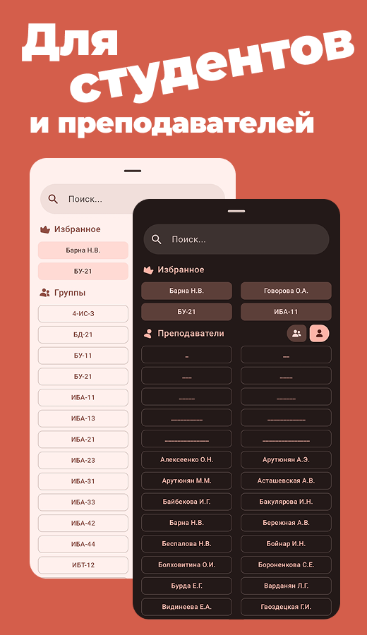
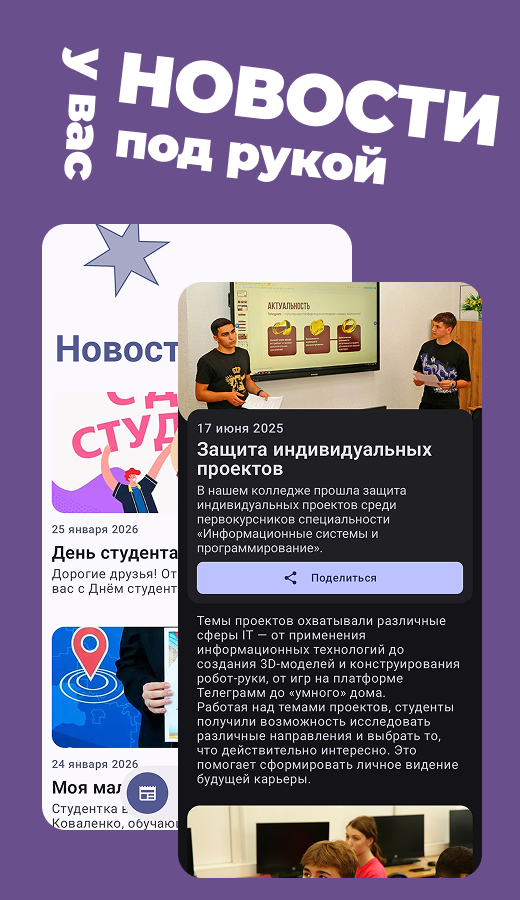

# 🌿 WHAT Schedule · Умное расписание


**Твой цифровой сад учебного времени**  
_Вырасти свой идеальный график — просто, быстро, зелёно._ 🌱

---

## 🌱 Посади расписание в свой телефон

[](https://github.com/whatrushki/WHAT-Schedule-android/releases/latest/download/what-schedule.apk)

[](https://www.rustore.ru/catalog/app/app.what.schedule)

## 🎋 Screenshots

|  |  |  |
|:----------------------------------:|:----------------------------------:|:----------------------------------:|
|  |  |  |

## 🍃 Почему WHAT Schedule?

**WHAT Schedule** — это не просто ещё одно приложение с расписанием. Это твой персональный
ассистент, который чувствует ритм студенческой жизни.

* 🌳 **Естественная простота**  
  Чистый интерфейс без шелухи. Ничего лишнего — только ясные учебные маршруты и интуитивное
  управление.

* ⚡ **Мгновенная синхронизация**  
  Все изменения в расписании подхватываются автоматически. Обновления приходят как весенний
  ветерок — незаметно, но всегда вовремя.

* 🎨 **Живые, дышащие темы**  
  Под любое настроение и время суток. Светлая, тёмная, зелёная — выбирай, во что окрасится твой
  день.

* 📱 **Виджеты-саженцы**  
  Вырасти своё расписание прямо на главном экране. Все нужные детали — в один взгляд, без лишних
  taps.

## 🌍 Экосистема возможностей

### 📚 Поддержка учебных заведений

| **Вуз**     | **Статус**                                               | 
|-------------|----------------------------------------------------------| 
| РКСИ        | 🌟 Цветёт                                                | 
| ДГТУ        | 🌟 Цветёт                                                | 
| РГЭУ (РИНХ) | 🌟 Цветёт                                                | 
| ИУБиП       | 🛟 Тех работы                                            | 
| Твой вуз?   | 🪴 Готов к посадке [Предложить](https://t.me/whatrushik) |

### 🌿 Технологический сад

```kotlin
Jetpack Compose   // Современный UI 
Glance            // Compose виджеты на рабочий стол
Ktor              // Лёгкий как перо клиент для общения с API
Koin              // Практичный и производительный DI-фреймворк
Room              // Надёжная и типобезопасная прослойка для базы данных
```

## 🌻 Что расцветает в ближайшем будущем?

- [x] MVP
- [x] Кеширование
- [x] Виджеты на главный экран
- [x] Темы
- [x] Интеграция новостей
- [x] Личные кабинеты

## 💚 Стань садовником проекта

1. **Тестировщик-ботаник** → [Написать](https://t.me/whatrushik)
2. **Инициатор новых сортов** → [Написать](https://t.me/whatrushik)
3. **Дизайнер экосистемы** → [Написать](https://t.me/whatrushik)

```text
MIT License · © 2024 whatrushik
Свободно расти и процветать 🌍
```

<div align="center">
  <sub>С любовью выращено для студентов и преподавателей. Поливайте звездочкой ⭐ — и наш сад станет краше!</sub><br>
</div>
